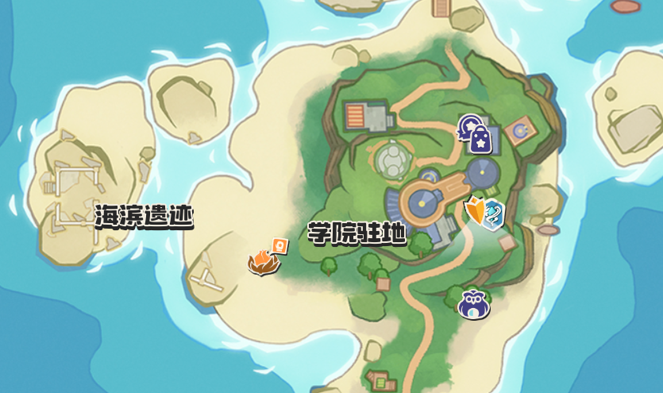

# 洛克王国 - 向阳花全自动综合采集脚本

本项目包含一个基于 AutoHotkey (AHK) 编写的全自动脚本，结合了图像识别、鼠标精确点击与按键循环机制，专门用于《洛克王国》中高效且无人值守地刷取“向阳花”。

## 🌻 游戏核心自动化机制

该脚本 (`luoke_pgup.ahk`) 的运行完全基于游戏内的刷新机制及自动化按键编排，包含如下关键流程：
1. **自动调出地图/面板**：按下 `M` 键进入地图或其他交互面板，并点击指定区域。
2. **图像识别定位追踪**：
   - 自动在全屏寻找 `image1.png`，识别到后精准点击其中心偏下位置，紧接着盲点另一处交互坐标。
   - 在特定范围内持续等待识别 `image2.png`，识别成功后正式进入连环刷花流程（未能识别则安全等待重试）。
3. **动作刷新与重置**：借鉴原先的逻辑，依次释放奇丽花并循环执行高频情感动作（不断切换宠物或收放宠物），重复触发产生向阳花的概率判定。

### 建议与要求
为了保障图像识别的精确运行，请确保您的游戏画面无遮挡，并在本目录下准备好对应的 `image1.png` 和 `image2.png` 图像切片片段。

---

## 🛠️ 环境依赖与运行方式

> **提示**：仓库中提供的 `pgup.exe` 文件为已经打包好的独立可执行程序，如果您觉得方便且信任，可**直接运行 pgup.exe（建议右键“以管理员身份运行”）**，完全**跳过下方环境安装步骤**。

若您希望运行和编辑 `luoke_pgup.ahk` 源码脚本，需要先为电脑安装 AutoHotkey 运行环境：

1. **访问官网**：前往 AutoHotkey 官方网站 [https://www.autohotkey.com/](https://www.autohotkey.com/)
2. **下载安装包**：点击首页的 "Download" 按钮。环境版本需兼容 AHK v1.x 系列（如 v1.1.37.02）。
3. **安装环境**：双击下载的安装程序进行 "Express Installation" (快速安装)。
4. **运行代码**：直接对 `luoke_pgup.ahk` 文件**右键，选择“以管理员身份运行”**。

---

## 🚀 准备与使用说明

### ✨ 启动流程与热键
1. **备战前置**：登录游戏，游戏界面分辨率调整到`1600*900`，传送到学院驻地的魔力之源。2号位放置好灵巧的宠物或者迪莫，其他号位放置奇丽花。需要保证人物没有站在`image1.png`中的区域，否则会识别不到。如果地图中没有显示学院驻地那片地方，需要你手动拖动到学院驻地附近，过程中请一直保持地图最大的状态！
2. **启动脚本进程**：在本目录下，**以管理员身份运行** `luoke_pgup.ahk`（或纯净版 `.exe`）。运行成功后系统右下角将出现绿色的特定图标（通常带有一个白色的 `H`）。
3. **开刷 / 停止操作**：
   - 切换回游戏主界面，按下键盘上的 **`PageUp` (PgUp)** 键启动全自动挂机进程！
   - 需要中断操作或停止挂机时，**再次按下** **`PageUp`** 键即可随时安全暂停脚本，不会产生黏键。

### 📜 脚本运行原理细节
脚本开始后会立即执行如下循环：
- 屏幕会出现对应的英文 `ToolTip` 提示当前进度（如：`Action: Pressing M Key` 等）。
- 首先激活地图与点击识别：按 `m` 键 → 找两图联动点击。
- 当 `image2.png` 出现后，接力执行依次选定 1/3/4/5/6 号位宠物并左键交互判定。
- 随后执行一套释放连招 8 到 12 次：`Tab` 切动作、`2` 键鞠躬、`Esc` 键退出、`R` 键骑乘、`X` 键取消骑乘。

---

## 🛑 工具通用关闭方法

如果您遇到异常无法停止进程的情况：
- 在桌面右下角任务栏系统托盘处找到带有 AHK 标志（默认绿色 `H`）的图标，**右键点击**并选择 **"Exit"** (退出) 即可彻底关闭当前运行的脚本。

> **⚠️ 免责声明**：本脚本仅用于原理解析与自动化技术交流。长期的连续自动化键鼠模拟可能会违反部分厂商的游戏用户协议，请适度使用、见好就收，一切封号等连带风险自负。